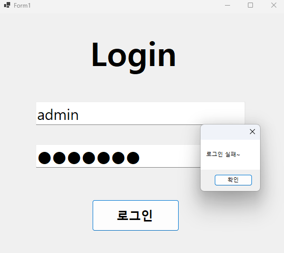
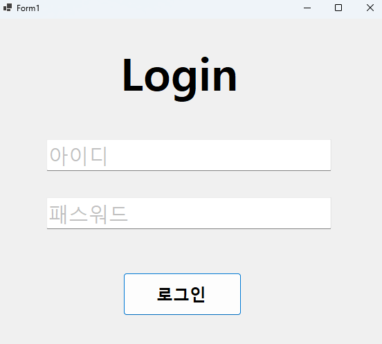
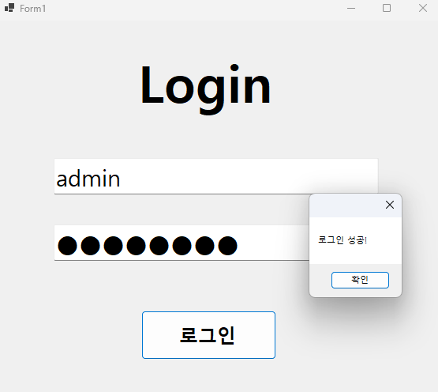
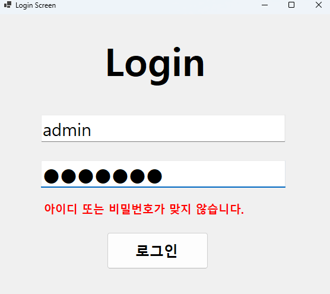

# LoginScreen

# (C# 코딩) LoginScreen 과제

## 개요
- C# 프로그래밍 학습
- 1줄 소개: 메세지를 입력하고 이를 로그에 기록하는 메신저 프로그램
- 사용한 플랫폼:
  -C#, .NET Windows Forms, Visual Studio, GitHub
- 사용한 컨트롤:
  - Label, TextBox, Button
- 사용한 기술과 구현한 기능:
  - Visual Studio를 이용하여 UI 구현
  - label.visible을 활용하여 로그인 실패 시 경고 메시지 표시
  - Focus를 활용하여 엔터키를 누를 시 자동으로 다음 스텝으로 넘어가도록 구현
  - Enter, Leave를 활용하여 TextBox에 입력 힌트 표시 및 제거 기능 구현
  - && 연산자를 활용하여 로그인 성공, 실패 확인 구현
  - UseSystemPasswordChar를 활용하여 password 입력 시 글자 숨기기 기능 구현

## 실행 화면 (과제1)
- 과제1 코드의 실행 스크린샷

- 과제 내용
  - TextBox(아이디, 패스워드), Button(로그인) 등을 적절히 배치합니다.
  - 아이디와 패스워드 입력 힌트를 회색으로 표시
  - 아이디와 패스워드가 모두 맞아야 로그인 허용
  - 적절한 메시지 박스 사용

- 구현 내용과 기능 설명
  - Enter, Leave를 활용하여 TextBox에 입력 힌트 표시 및 제거 기능 구현
  - && 연산자를 활용하여 로그인 성공, 실패 확인 기능 구현
  - MessageBox.Show를 활용하여 로그인 성공, 실패 시 적절한 메시지 박스 표시

## 실행 화면 (과제2)
- 과제2 코드의 실행 스크린샷

- 과제 내용
  - Label 컨트롤 추가
  - Visible 속성을 이용해서 메시지 보이기와 숨기기 기능 구현

- 구현 내용과 기능 설명
  - label.Visible을 활용하여 로그인 실패 시 경고 메시지 표시 기능 구현